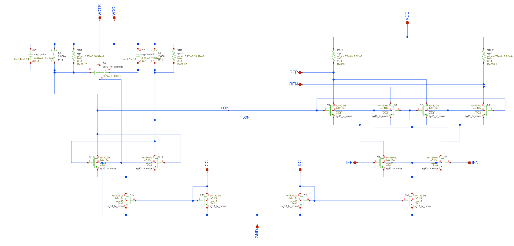
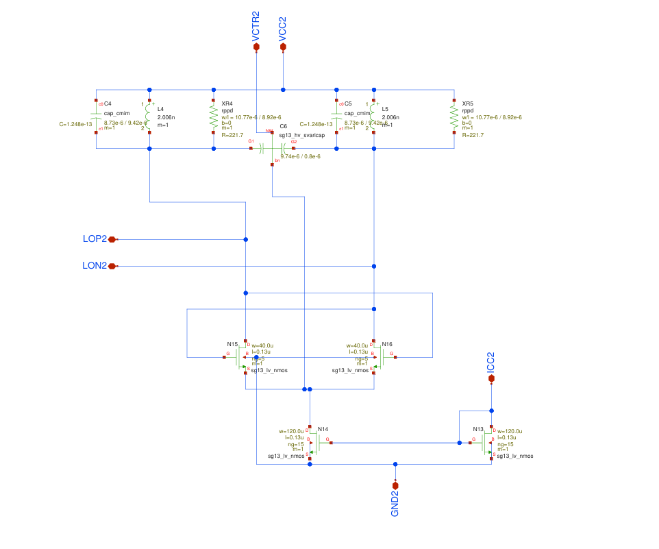
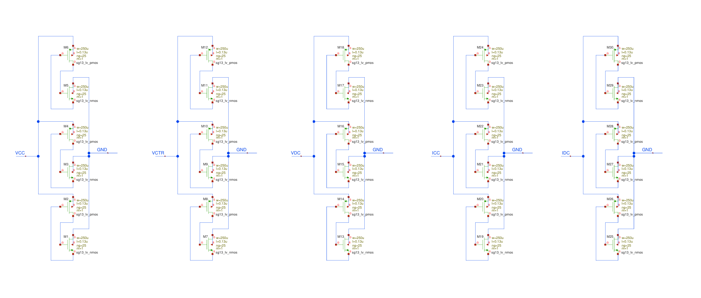
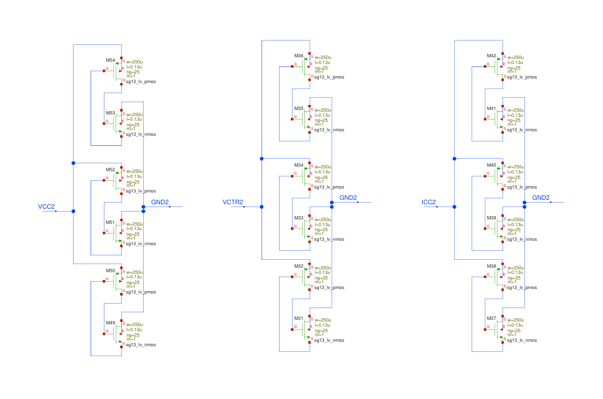
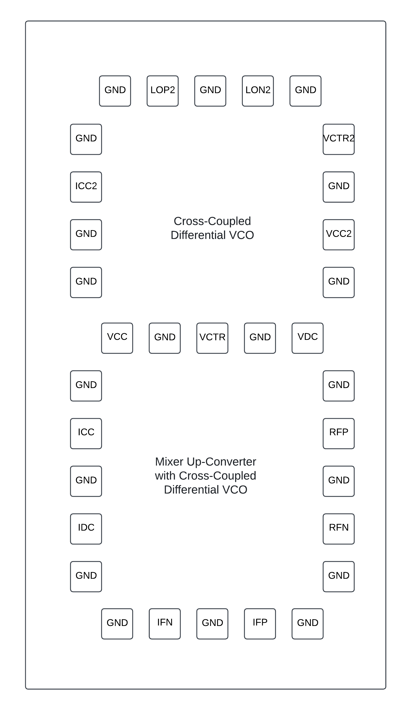
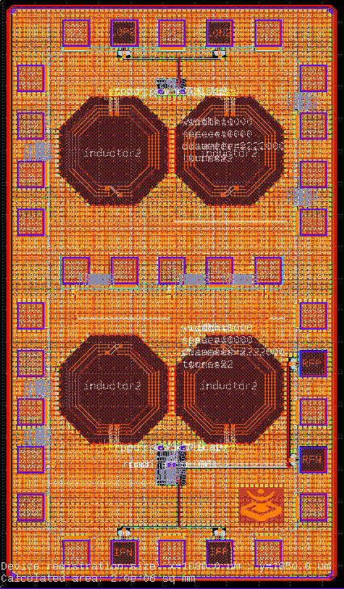

5 GHz Up-Converter Mixer with Cross-Coupled VCO and Cross-Coupled VCO 
###################################

Understanding the operation of electronic circuits applied in low-temperature environments is crucial for the implementation of systems aimed at quantum computing. This is because, in cryogenic environments, material properties and device behavior can differ significantly from those observed at conventional temperatures.

To characterize circuits at both conventional and cryogenic temperatures, a chip was developed to test the behavior of the designs proposed below.

Mixer Up-Converter with Cross-Coupled Differential VCO:

- IFP and IFN: Differential input pair
- RFP and RFN: Differential output pair
- VDC: Power supply terminal (Mixer)
- VCC: Power supply terminal (Oscillator)
- VCTR: Voltage control terminal
- IDC: Bias current terminal (Mixer)
- ICC: Bias current terminal (Oscillator)
- GND: Ground terminal

Cross-Coupled Differential VCO:

- LOP2 and LON2: Differential output pair
- VCC2: Power supply terminal
- VCTR2: Voltage control terminal
- ICC2: Bias current terminal
- GND2: Ground terminal

Electrostatic Discharge
###########

Mixer Up-Converter with Cross-Coupled Differential VCO:

Cross-Coupled Differential VCO:

Chip Pinout
###########

